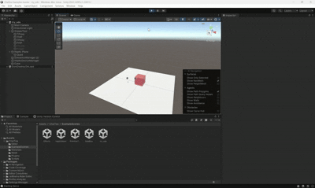

# ChaiTea 示例项目

本项目是一个 Unity 示例工程，演示如何将 **ChaiTea** 触觉反馈库与 **PICO VR 头显**结合使用，实现虚拟现实环境下的力反馈交互操作。项目以 Omega 主操作手作为力反馈输入设备，以 PICO 头显提供沉浸式 VR 视角，通过 Unity 进行集成调试。项目包含多个示例场景、触觉脚本及材质配置，涵盖多种触觉交互效果。

---

## 环境要求

| 项目 | 版本 / 说明 |
|---|---|
| Unity 编辑器 | 2022.3.49f1c1 (LTS) |
| 操作系统 | Windows 64位 |
| VR 头显 | PICO（通过 PICO 官方 Unity SDK 接入） |
| 触觉设备 | Geomagic Touch / Phantom Omni / Omega 主操作手（或兼容设备） |
| 原生插件 | `ChaiTeaLib.dll`、`ChaiTeaPlugin.dll`、`hdPhantom64.dll`、`sixense_x64.dll` |

> 所需原生 DLL 已包含在 `Assets/ChaiTea/Plugins/` 目录下。  
> 本示例工程所使用的原生 DLL 来源于另一个仓库项目：**LJY008/PICO_OMEGA7_DLL**  
> 可前往该仓库获取/更新对应 DLL：<https://github.com/LJY008/PICO_OMEGA7_DLL>  

---

## PICO 头显接入说明

本项目通过 **PICO 官方提供的 Unity 开发教程** 完成头显与 Unity 场景的联调，相关配置均在 Unity 编辑器设置中完成，无需额外代码。主要步骤如下：

1. **安装 PICO Unity Integration SDK**  
   参考 PICO 官方文档：[https://developer-cn.picoxr.com/document/unity/](https://developer-cn.picoxr.com/document/unity/)  
   将 SDK 导入 Unity 项目（`Assets` 目录下）。

2. **配置 XR 插件管理**  
   进入 `Edit → Project Settings → XR Plug-in Management`，勾选 **PICO** 作为 XR 提供商（Android 平台）。

3. **设置构建目标**  
   `File → Build Settings` 中将平台切换为 **Android**，并在 `Player Settings` 中配置好包名、最低 API 等级等参数。

4. **连接头显调试**  
   通过 USB 数据线将 PICO 头显连接至 PC，启用开发者模式后，可直接从 Unity 编辑器构建并推送至设备进行调试。

> 具体操作步骤请以 PICO 官方最新文档为准。

---

## 项目结构

```
Assets/
└── ChaiTea/
    ├── Editor/          # Unity Inspector 自定义编辑器
    ├── ExampleScenes/   # 四个示例 Unity 场景
    ├── Materials/       # 触觉材质预设（.mat）
    ├── Mesh/            # 自定义三维网格资产（.obj）
    ├── Plugins/         # 原生 DLL 插件
    └── Scripts/         # 所有 C# 运行时脚本
```

---

## 示例场景

| 场景 | 说明 |
|---|---|
| **Effects** | 演示振动、粘滞、粘滑、磁力四种触觉效果。 |
| **HapticMesh** | 使用自定义导入的 `.obj` 网格作为触觉碰撞对象。 |
| **SolidBox** | 一个可配置触觉材质属性的实体盒子。 |
| **PrimitiveTypes** | 包含球体、盒子、平面、圆柱体等基本触觉几何形状的场景。 |
| **ODESimulation** | 集成 ODE（开放动力学引擎）的物理仿真场景，演示动态刚体（盒子）在重力与阻尼作用下的运动，并通过 GripperTool 夹持器进行实时触觉交互；仿真循环运行于独立线程，Unity 场景同步通过主线程任务队列安全更新。 |

---

## 核心脚本说明

### 世界与设备管理

| 脚本 | 说明 |
|---|---|
| `HapticWorld.cs` | ChaiTea `World` 对象的单例封装，负责初始化仿真世界并提供全局访问入口。 |
| `HapticDeviceManager.cs` | 查询并输出触觉设备信息（型号、制造商、工作空间半径、最大刚度、最大阻尼）。 |
| `ODEWorld.cs` | 管理 ODE（开放动力学引擎）物理世界的单例，支持重力和阻尼配置。 |

### 触觉工具（输入）

| 脚本 | 说明 |
|---|---|
| `CursorTool.cs` | 点光标触觉工具，追踪代理点（Proxy）和触觉交互点（HIP）的位置，并以 GameObject 的形式在场景中渲染。 |
| `GripperTool.cs` | 夹持器式触觉工具，分别追踪拇指和手指的代理点及 HIP 位置。 |

### 触觉对象

| 脚本 | 说明 |
|---|---|
| `HapticObject.cs` | 所有触觉场景对象的抽象基类，负责材质赋值与世界注册。 |
| `HapticPrimitiveShape.cs` | 继承 `HapticObject`，为基本几何形状提供基于标志位的触觉效果创建支持。 |
| `HapticBox.cs` | 触觉盒子形状。 |
| `HapticSphere.cs` | 触觉球体形状。 |
| `HapticCylinder.cs` | 触觉圆柱体形状。 |
| `HapticPlane.cs` | 触觉无限平面形状。 |
| `HapticMesh.cs` | 将 Unity `MeshFilter` 中的网格加载为 ChaiTea 触觉网格对象。 |

### 材质与效果

| 脚本 | 说明 |
|---|---|
| `HapticMaterial.cs` | 配置 ChaiTea 触觉材质，支持刚度、阻尼、静/动摩擦、振动（频率与幅度）、粘滑（最大力与刚度）、粘滞、磁力（最大力与距离）等属性。 |

### 仿真循环

| 脚本 | 说明 |
|---|---|
| `Simulation.cs` | 在独立线程中为 `GripperTool` 运行触觉仿真循环。每帧依次完成：计算全局位姿、从设备更新工具状态、计算交互力、向设备施加力。 |
| `SimulationG.cs` | 扩展版仿真循环，集成 ODE 物理引擎，并通过主线程任务队列安全地执行 Unity API 调用。 |
| `ODEGenericBody.cs` | 封装 ChaiTea `ODEgenericbody`，绑定 `HapticBox` 形状，创建可配置质量的动态盒子刚体，并启用 ODE 动力学模拟。 |

---

## 触觉材质属性说明

`HapticMaterial` 组件在 Inspector 中开放以下可序列化字段：

| 属性 | 说明 |
|---|---|
| `Stiffness`（刚度） | 表面阻力大小（默认值：100） |
| `Damping`（阻尼） | 基于速度的阻尼力 |
| `Static Friction`（静摩擦） | 物体静止时的摩擦力 |
| `Dynamic Friction`（动摩擦） | 物体运动时的摩擦力 |
| `Vibration Frequency`（振动频率） | 振动效果的频率（Hz） |
| `Vibration Amplitude`（振动幅度） | 振动效果的幅度 |
| `Stick-Slip Max Force`（粘滑最大力） | 粘滑效果的最大力 |
| `Stick-Slip Stiffness`（粘滑刚度） | 粘滑效果的刚度分量 |
| `Viscosity`（粘滞） | 类流体的阻力 |
| `Magnetic Max Force`（磁力最大值） | 磁力效果的最大吸引力 |
| `Magnetic Max Distance`（磁力作用距离） | 磁力效果开始生效的距离 |

---
## 演示预览

### 物理模型场景（ODESimulation）



### VR+力反馈操作场景
.gif).
.gif).
## 快速开始

1. **克隆仓库：**
   ```bash
   git clone https://github.com/LJY008/PICO_OMEGA7_EXAMPLE.git
   ```

2. 使用 **Unity Hub** 打开项目，选择 Unity 版本 `2022.3.49f1c1`。

3. **连接触觉设备**，确保 Geomagic Touch 驱动已启动。

4. 打开 `Assets/ChaiTea/ExampleScenes/` 中的**任意示例场景**。

5. 在 Unity 编辑器中点击 **Play**，触觉伺服循环将自动启动。

---

## 架构说明

- **线程安全**：触觉仿真循环运行在独立的后台线程中。Unity API 的调用（如 Transform 访问）在线程启动前完成缓存，或通过主线程任务队列（见 `SimulationG.cs`）分发执行。
- **单例模式**：`HapticWorld` 和 `ODEWorld` 均采用懒加载单例，确保整个场景生命周期内只存在一个世界实例。
- **效果标志位**：`HapticPrimitiveShape` 使用 `[Flags]` 枚举 `ChaiTea.EffectType`，允许在 Inspector 中为单个对象组合多种触觉效果。

---

## 许可证

详见 [LICENSE.txt](LICENSE.txt)。

